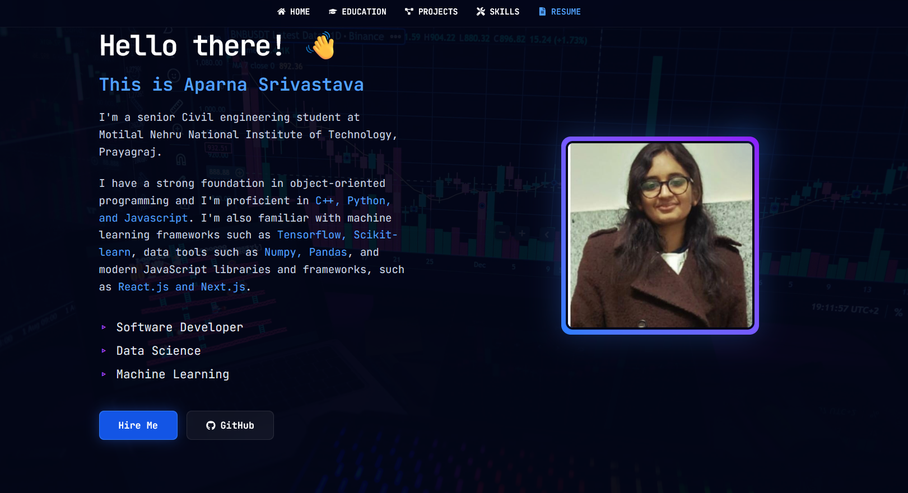
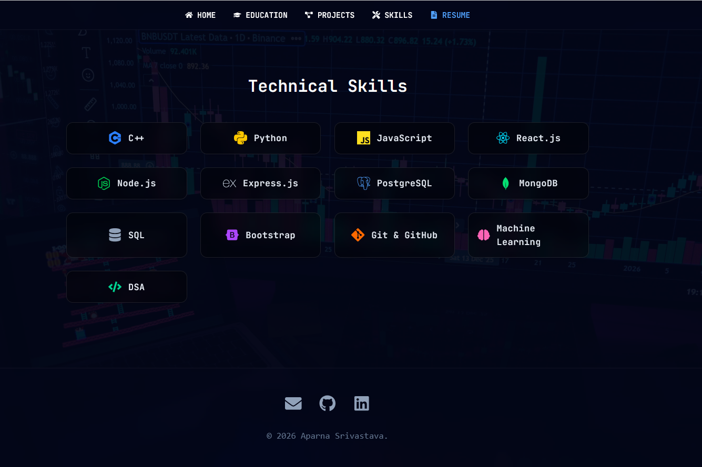
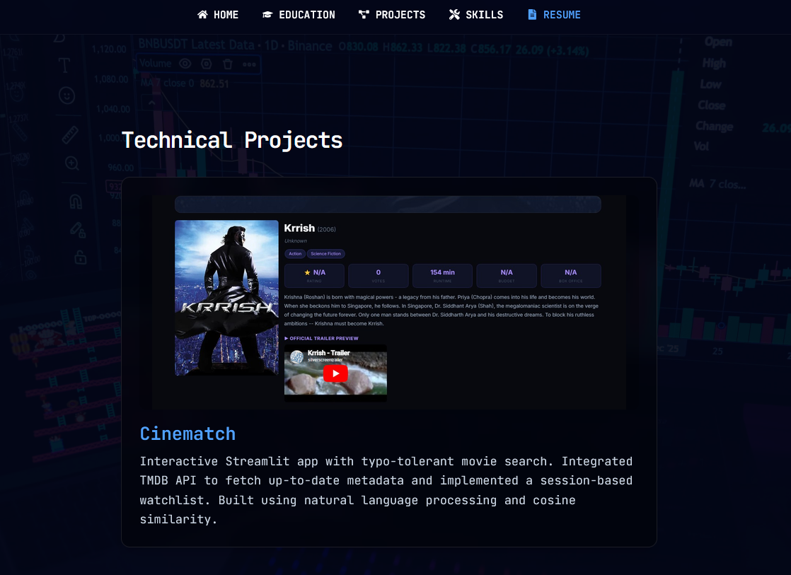

# Aparna Srivastava | Professional Portfolio

Welcome to the repository for my personal portfolio website! This project serves as an interactive showcase of my technical skills, educational background, and software development projects.

## 🚀 Live Demo
**[View Live Portfolio]([https://portfolio-three-azure-35.vercel.app/projects])**

---

## 👀 A Look Inside

### About Me

*A brief introduction and overview of my professional background and expertise.*

### Technical Skills

*A responsive, animated grid showcasing my proficiency in various languages, frameworks, and tools.*

### Featured Projects

*Interactive project cards highlighting my work, including the Construction Site Tracker and Cinematch.*

---

## 🛠️ Tech Stack
This portfolio was built with modern web technologies to ensure a responsive, smooth, and animated user experience:
* **Frontend:** React.js, Vite
* **Styling:** Tailwind CSS
* **Animations:** Framer Motion
* **Routing:** React Router DOM
* **PDF Rendering:** React-PDF (for seamless resume integration)
* **Deployment:** Vercel

## 📂 Featured Projects in this Portfolio
* **Cinematch:** An interactive Streamlit application with typo-tolerant movie search, utilizing NLP and cosine similarity. Integrated with the TMDB API for up-to-date metadata.
* **Construction Site Tracker:** A full-stack MERN application featuring JWT authentication, role-based access control, an admin dashboard, and secure file uploads using Multer.
* **Personal Portfolio:** This responsive showcase featuring virtual entrance animations and seamless routing.

## 💻 Technical Expertise
* **Languages:** C++, Python, JavaScript, SQL
* **Frameworks & Libraries:** React.js, Next.js, Node.js, Express.js, Bootstrap
* **Machine Learning & Data:** TensorFlow, Scikit-learn, NumPy, Pandas
* **Databases:** PostgreSQL, MongoDB
* **Tools:** Git, GitHub, VS Code

## 📫 Connect With Me
* **Email:** aparnasri2106@gmail.com
* **GitHub:** [aparna21-6](https://github.com/aparna21-6)
* **LinkedIn:** [https://www.linkedin.com/in/aparna-srivastava-5b37b9312/]

---
*Open to placements and internships in Software Engineering and Machine Learning.*